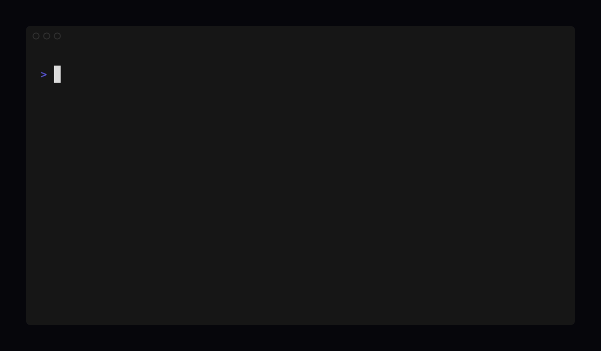

<h1 align="center">ztrack</h1>

<p align="center"><strong>Typecheck and lint your task management.</strong> Done is earned, not declared.</p>

<p align="center">
  <a href="https://github.com/volter-ai/ztrack/blob/main/LICENSE"></a>
  <a href="https://www.npmjs.com/package/ztrack"></a>
  <a href="https://github.com/volter-ai/ztrack/actions"></a>
</p>

<p align="center"></p>

AI coding agents close tickets on prose. "All tests pass, feature complete" — and the
commit it cited never existed. Your tracker stored the claim with perfect fidelity and
verified nothing.

**ztrack is a typechecker for your issue tracker.** A checked acceptance criterion must
cite a commit SHA that exists in git and is an ancestor of the branch head, evidence that
resolves, screenshots/videos that exist — or it fails with a non-zero exit. The task
schema is defined in [Zod](https://zod.dev).

## Quickstart (under a minute)

```bash
npx ztrack init      # writes a config: green with just git + a PR host
ztrack check         # typecheck your tasks
```

Cite a real commit and a matching PR → pass. Cite a fake SHA → exit 1.

```text
$ ztrack check

  ✓ DEMO-2  auth middleware           2 ACs, evidence ok
  ✓ DEMO-3  rate limiter              1 AC, evidence ok
  ✗ DEMO-1  "API returns 200"
      checked_dev_ac_commit_hash_missing
      cites a1b2c3d — not found in git

✗ 1 error  — the agent said done. the commit doesn't exist.
exit 1
```

## Works with your tracker — no migration

ztrack is a verification layer, not a replacement. Point it at your **Linear**, **Jira**,
or **GitHub Issues**; agents work against ztrack, and only validated state syncs back to
the tool your team already lives in.

## Typed with Zod

Tasks are Zod schemas. `fmt` canonicalizes them, `lint` flags the valid-but-suspicious,
and `check` is the typechecker.

> **Lint errors are fixed by editing text. Type errors are fixed by producing evidence.**

## Gradual rigor

Rules are organized into categories — well-formed, sourced, code, visual, behavioral —
each with a depth dial, like turning up strictness in a typechecker. Start where your team
is (git + a PR host) and ratchet up. Claims above your configured rigor aren't dropped —
they're counted honestly: *"valid at this level; 14 claims unverified at higher rigor."*

| Category | What it checks | Instrumentation |
|---|---|---|
| **well-formed** | the record parses and refers to things that exist | the tracker alone |
| **sourced** | every requirement traces to where it came from | none → world mirror |
| **code** | a checked AC cites a real commit; evidence stays fresh | git + a PR host |
| **visual** | a checked UI AC carries a resolving image proof | screenshot capability |
| **behavioral** | a checked AC carries pass/fail (optionally human-verified) video | a deployable scenario |

## For agents

- **MCP:** `claude mcp add ztrack -- ztrack mcp start`
- **CI gate:** run `ztrack check` in your pipeline
- **Stop-hook:** block an agent's turn until `check` is green — agents fix-and-retry a typechecker until it passes

## Why believe it

ztrack runs our own autonomous agent fleet in production — it's what we use to ship real
code. Every release re-proves in CI that a fabricated commit SHA fails the check.

## How it compares

| | Records claim | Validates structure | Verifies evidence of "done" |
|---|:---:|:---:|:---:|
| Linear / Jira | ✓ | shape only | — |
| Beads / Backlog.md | ✓ | partial | — |
| spec-kit / OpenSpec | ✓ | ✓ (prose shape) | — |
| Eval / observability | ephemeral | — | scores outputs |
| **ztrack** | ✓ | ✓ | ✓ |

## License

[Apache-2.0](LICENSE)
